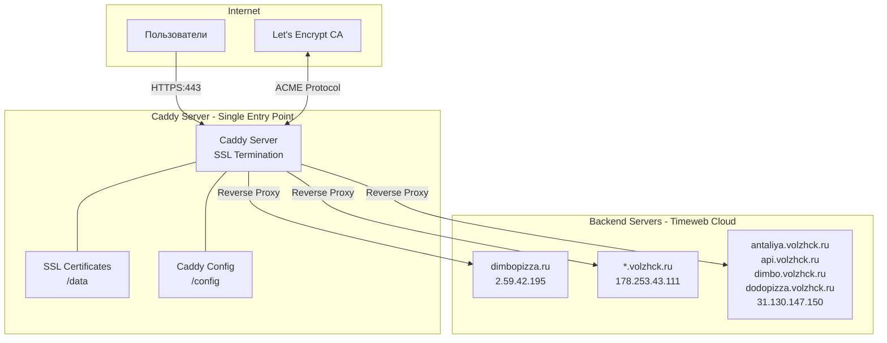

# SSL-Certificates-API

## Описание проекта

**Название:** SSL-Certificates-API  
**Версия:** 1.0.0  
**Дата создания:** 2025-12-05  
**Статус:** В разработке

### Цель проекта

Создание веб-сервиса для автоматического выпуска и продления SSL-сертификатов для доменов и поддоменов, размещённых на платформе [Timeweb Cloud](https://timeweb.cloud/). Сервис использует [Caddy Server](https://github.com/caddyserver/caddy) как основной инструмент для управления сертификатами через Let's Encrypt.

### Бизнес-требования

1. Автоматический выпуск SSL-сертификатов для новых доменов
2. Автоматическое продление сертификатов до истечения срока действия
3. Поддержка множества доменов и поддоменов на разных серверах
4. Централизованное управление конфигурацией
5. Минимальное время простоя при обновлении сертификатов

---

## Архитектура системы

### Общая схема



### Карта серверов и доменов

| Домен | IP адрес | Назначение |
|-------|----------|------------|
| dimbopizza.ru | 2.59.42.195 | Основной сайт пиццерии |
| *.volzhck.ru (wildcard) | 178.253.43.111 | Wildcard для всех поддоменов |
| antaliya.volzhck.ru | 31.130.147.150 | Проект Antaliya |
| api.volzhck.ru | 31.130.147.150 | API сервис |
| dimbo.volzhck.ru | 31.130.147.150 | Dimbo проект |
| dodopizza.volzhck.ru | 31.130.147.150 | Dodopizza проект |

### Компоненты системы

| Компонент | Описание | Технология |
|-----------|----------|------------|
| Caddy Server | Веб-сервер с автоматическим SSL | Caddy 2.10.x |
| Docker | Контейнеризация | Docker 24.x+ |
| Docker Compose | Оркестрация контейнеров | Docker Compose 2.x |
| Let's Encrypt | Certificate Authority | ACME v2 |

### Структура проекта

```
SSL-Certificates-API/
├── docker-compose.yml          # Основной файл оркестрации
├── Caddyfile                   # Конфигурация Caddy
├── .env                        # Переменные окружения
├── .env.example                # Пример переменных окружения
├── .cursorrules                # Правила для разработки
├── README.md                   # Основная документация
├── docs/
│   ├── Project.md              # Описание проекта
│   ├── Tasktracker.md          # Трекер задач
│   ├── Diary.md                # Дневник разработки
│   └── qa.md                   # Вопросы и ответы
├── config/
│   └── caddy/
│       └── Caddyfile.template  # Шаблон конфигурации
└── scripts/
    ├── setup.sh                # Скрипт первоначальной настройки
    └── add-domain.sh           # Скрипт добавления домена
```

---

## Технологический стек

### Основные технологии

| Технология | Версия | Назначение |
|------------|--------|------------|
| Caddy | 2.10.2-alpine | Веб-сервер, reverse proxy, SSL |
| Docker | 24.0+ | Контейнеризация |
| Docker Compose | 2.20+ | Оркестрация |
| Alpine Linux | 3.19+ | Базовый образ |

### Протоколы и стандарты

- **ACME v2** - протокол автоматического получения сертификатов
- **TLS 1.3** - современный стандарт шифрования
- **HTTP/2, HTTP/3** - современные протоколы передачи данных
- **OCSP Stapling** - оптимизация проверки сертификатов

---

## Конфигурация

### Docker Compose

```yaml
version: '3.8'

services:
  caddy:
    image: caddy:2.10.2-alpine
    container_name: ssl-caddy
    restart: unless-stopped
    command: ["caddy", "run", "--config", "/etc/caddy/Caddyfile", "--resume"]
    cap_add:
      - NET_ADMIN
    ports:
      - "80:80"
      - "443:443"
      - "443:443/udp"
    volumes:
      - ./Caddyfile:/etc/caddy/Caddyfile:ro
      - caddy_data:/data
      - caddy_config:/config
    environment:
      - ACME_EMAIL=${ACME_EMAIL}
    logging:
      driver: json-file
      options:
        max-size: "10m"
        max-file: "3"
    networks:
      - ssl_network
    healthcheck:
      test: ["CMD", "caddy", "version"]
      interval: 30s
      timeout: 10s
      retries: 3

volumes:
  caddy_data:
    driver: local
  caddy_config:
    driver: local

networks:
  ssl_network:
    driver: bridge
```

### Caddyfile (конфигурация с реальными IP)

```caddyfile
{
    # Глобальные настройки
    email baganov.v@gmail.com
    
    # Настройки ACME
    acme_ca https://acme-v02.api.letsencrypt.org/directory
    
    # Логирование
    log {
        output stdout
        format json
        level INFO
    }
}

# Домен dimbopizza.ru
dimbopizza.ru {
    reverse_proxy http://2.59.42.195:80
    
    encode gzip zstd
    
    header {
        Strict-Transport-Security "max-age=31536000; includeSubDomains; preload"
        X-Content-Type-Options "nosniff"
        X-Frame-Options "DENY"
    }
}

# Wildcard для *.volzhck.ru (требует DNS challenge)
*.volzhck.ru {
    reverse_proxy http://178.253.43.111:80
    
    encode gzip zstd
    
    header {
        Strict-Transport-Security "max-age=31536000; includeSubDomains"
        X-Content-Type-Options "nosniff"
    }
    
    # DNS challenge для wildcard сертификата
    tls {
        dns cloudflare {env.CF_API_TOKEN}
    }
}

# Домены на сервере 31.130.147.150
antaliya.volzhck.ru, api.volzhck.ru, dimbo.volzhck.ru, dodopizza.volzhck.ru {
    reverse_proxy http://31.130.147.150:80
    
    encode gzip zstd
    
    header {
        Strict-Transport-Security "max-age=31536000; includeSubDomains"
        X-Content-Type-Options "nosniff"
    }
}
```

> ⚠️ **Важно:** Для wildcard сертификата `*.volzhck.ru` требуется DNS challenge. Необходимо настроить доступ к DNS API провайдера (Cloudflare, Timeweb и т.д.).

---

## Безопасность

### Требования безопасности

1. **TLS Configuration**
   - Минимальная версия: TLS 1.2
   - Рекомендуемая версия: TLS 1.3
   - Отключение устаревших cipher suites

2. **HTTP Security Headers**
   - Strict-Transport-Security (HSTS)
   - X-Content-Type-Options
   - X-Frame-Options
   - Content-Security-Policy

3. **Certificate Management**
   - Автоматическое продление за 30 дней до истечения
   - Мониторинг статуса сертификатов
   - Резервное копирование ключей

4. **Docker Security**
   - Запуск от непривилегированного пользователя
   - Минимальные capabilities (только NET_ADMIN)
   - Read-only файловая система где возможно

---

## Мониторинг и логирование

### Метрики для отслеживания

| Метрика | Описание | Порог |
|---------|----------|-------|
| cert_expiry_days | Дней до истечения сертификата | < 30 - warning |
| request_duration | Время ответа | > 500ms - warning |
| error_rate | Процент ошибок | > 1% - critical |
| tls_handshake_time | Время TLS handshake | > 100ms - warning |

### Формат логов

```json
{
  "level": "info",
  "ts": 1701792000.000,
  "logger": "http.log.access",
  "msg": "handled request",
  "request": {
    "remote_ip": "192.168.1.1",
    "method": "GET",
    "host": "dimbopizza.ru",
    "uri": "/",
    "proto": "HTTP/2.0"
  },
  "status": 200,
  "duration": 0.015
}
```

---

## Этапы разработки

### Фаза 1: Инициализация (Текущая)
- [x] Создание структуры проекта
- [x] Написание документации
- [ ] Настройка базовой конфигурации Docker
- [ ] Создание Caddyfile

### Фаза 2: Базовая функциональность
- [ ] Развёртывание Caddy в Docker
- [ ] Настройка первого домена
- [ ] Тестирование получения сертификата
- [ ] Проверка автопродления

### Фаза 3: Масштабирование
- [ ] Добавление всех доменов
- [ ] Настройка reverse proxy
- [ ] Оптимизация производительности

### Фаза 4: Продакшн
- [ ] Настройка мониторинга
- [ ] Настройка алертов
- [ ] Документация по эксплуатации
- [ ] Процедуры backup/restore

---

## Стандарты разработки

### Именование

- **Файлы конфигурации:** lowercase с дефисами (`docker-compose.yml`)
- **Переменные окружения:** UPPER_SNAKE_CASE (`ACME_EMAIL`)
- **Docker volumes:** lowercase с underscore (`caddy_data`)
- **Docker networks:** lowercase с underscore (`ssl_network`)

### Код-ревью

Все изменения должны проходить через:
1. Локальное тестирование
2. Проверка синтаксиса конфигурации (`caddy validate`)
3. Код-ревью в PR
4. Тестирование в staging окружении

### Версионирование

Используется Semantic Versioning (SemVer):
- **MAJOR** - несовместимые изменения API
- **MINOR** - новая функциональность с обратной совместимостью
- **PATCH** - исправления багов

---

## Ссылки и ресурсы

- [Caddy Documentation](https://caddyserver.com/docs/)
- [Caddy GitHub](https://github.com/caddyserver/caddy)
- [Let's Encrypt Documentation](https://letsencrypt.org/docs/)
- [Docker Documentation](https://docs.docker.com/)
- [Timeweb Cloud](https://timeweb.cloud/)

---

## Контакты

**Ответственный:** Baganov V.  
**Email:** baganov.v@gmail.com

---

*Последнее обновление: 2025-12-05*

